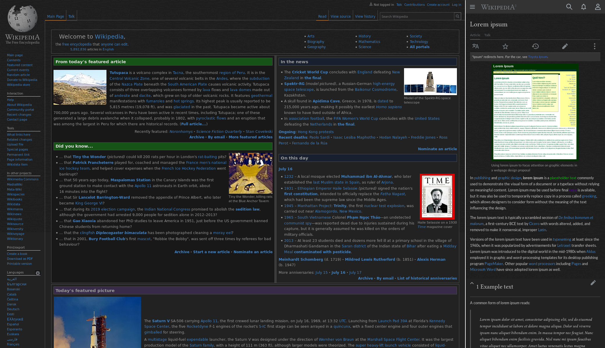

  
   
  
  
  
  
  
  

Applies to all Wikimedia wikis (wikipedia.org, wikidata.org, wiktionary.org, etc.), Wikidot wikis and the Arch Linux wiki.

## Preview

This theme also works with the mobile sites (Minerva skin). For more comparisons, see [the image gallery](./images/).

## Installation

### A userstyle extension is required, common ones include

🎨 Stylus for [Firefox](https://addons.mozilla.org/en-US/firefox/addon/styl-us/), [Chrome](https://chrome.google.com/webstore/detail/stylus/clngdbkpkpeebahjckkjfobafhncgmne) or [Opera](https://addons.opera.com/en-gb/extensions/details/stylus/).

🎨 xStyle for [Firefox](https://addons.mozilla.org/firefox/addon/xstyle/) or [Chrome](https://chrome.google.com/webstore/detail/xstyle/hncgkmhphmncjohllpoleelnibpmccpj).

### Then install using one of these methods

📦 [Install the usercss](https://github.com/StylishThemes/Wikipedia-Dark/raw/master/wikipedia-dark.user.css) with Stylus or xStyle. Supports automatic updates.

## Additional Userstyles

⚙️ [Overlay-Scrollbars](https://github.com/StylishThemes/Overlay-Scrollbars) 
⚙️ [Wikipedia Dark Gray Text Colors](https://github.com/StylishThemes/Feature-Override-Styles) 
⚙️ [Wikipedia Dark IMG Styles](https://github.com/StylishThemes/Feature-Override-Styles) 

>Note: With exception of the Overlay Scrollbars style the Wiki additional styles are NOT to be used on their own without the Wikipedia Dark style also installed ;)

## Limitations

### Wikipedia Dark only supports the default wikipedia `vector` theme.

> Support for other themes are graciously accepted via a pull request... If interested please open a new issue to discuss your intentions before proceeding.

* Many of the table cells have inline styling to add a background colors.
  * Some of the very common stylings have been replaced using attribute selectors ( e.g. `th[style*="background:#eee" i]` ).
  * But due to the sheer number of possibilities, the replaced css style would also need to include selectors such as `th[style*="background-color: #eee" i]` and `th[style*="background-color:#eee" i]`, `th[bgcolor="eee" i]` and `th[style*="background-color: #eeeeee" i]`, etc.
  * It would be a daunting task to find and replace *all* of these colors. I hope you see my point.
  * If you *really* want a background color to be fixed, please share a pull request of the fix. We may not always have time to get to it.
* Not all images can be made readable.
  * This style uses a css filter to invert the images, but this really only works on basic black-and-white images.

## Contributions

If you would like to contribute to this repository, please...

1. 👓 Read the [contribution guidelines](./CONTRIBUTING.md).
1.  [Fork](https://github.com/StylishThemes/Wikipedia-Dark/fork) or  [download](https://github.com/StylishThemes/Wikipedia-Dark/archive/master.zip) this repository.
1. 👌 Create a pull request!

Thanks to all that have [contributed](./AUTHORS) so far!
